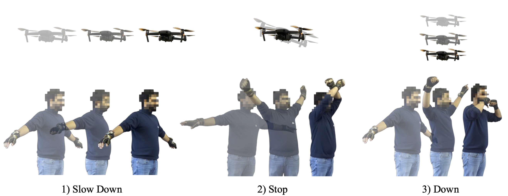

# Interpretable Multimodal Gesture Recognition for Drone and Mobile Robot Teleoperation 


Official implementation of the paper:

**Interpretable Multimodal Gesture Recognition for Drone and Mobile Robot Teleoperation via Log-Likelihood Ratio Fusion**

[Paper (arXiv)](https://arxiv.org/abs/2602.23694)

<p align="center">
  
</p>

This repository implements a **multimodal wearable-sensor gesture recognition framework** designed for **hands-free teleoperation of drones and mobile robots**.  
The system combines **IMU signals from Apple Watches** with **capacitive sensing gloves**, and fuses them using a **log-likelihood ratio (LLR)–based late fusion method** that improves interpretability and recognition performance.

Unlike vision-based gesture recognition systems, which degrade under **occlusions, poor lighting, or cluttered environments**, the proposed sensor-based approach remains robust in real-world operational settings such as disaster response and industrial environments. 

---

## Features

### Multimodal Sensor Fusion

The framework integrates signals from:

- Capacitive sensing gloves
- Apple Watch IMU sensors

Modalities used (l and r indicate left and right hand, respectively):
  - Capacitive glove data: `l_cap`, `r_cap`
  - Watch IMU data (accelerometer, gyroscope, quaternion): `l_acc`, `r_acc`, `l_gyro`, `r_gyro`, `l_quat`, `r_quat`

---

### Log-Likelihood Ratio (LLR) Fusion

We propose **Log-Likelihood Ratio (LLR) fusion**, which:

- Combines modality predictions through likelihood ratios
- Provides **interpretable modality contributions**
- Improves robustness for safety-critical teleoperation

Alternative fusion method implemented for comparison:

- **Self-attention fusion**

1D CNN → GRU → attention-based temporal aggregation

---

### Experiment Management

The code supports:

- **LOPO (Leave-One-Participant-Out)** evaluation
- **LOSO (Leave-One-Session-Out)** evaluation
- Experiment tracking using **MLflow**

Outputs include:

- confusion matrices
- modality contribution plots
- attention heatmaps
- model profiling (GFLOPs, size)

---

## Hardware Setup

Data was collected using a multimodal wearable sensing system.

### Textile Sensing Gloves

- 4 capacitive sensing channels
- stretchable textile electrodes
- FDC2214 capacitance-to-digital converter
- ~50 Hz sampling rate

### Apple Watch (Series 7)

- accelerometer
- gyroscope
- quaternion orientation
- ~100 Hz sampling rate

### RGB Camera

- ZED Mini stereo camera
- 30 FPS
- used for synchronization and dataset recording

---

## Dataset

We introduce a **multimodal gesture dataset** inspired by **aircraft marshalling signals**, commonly used in aviation ground operations.

### Dataset statistics

- **11 participants**
- **5 sessions per participant**
- **80 gesture instances per session**
- **20 gesture classes**

Example gesture classes include: 
- Stop
- Slow Down
- Left
- Right
- Move Away
- Brake
- Engine Start
- Take Photo
- Up
- Down

Each session includes synchronized:

- IMU data
- capacitive glove signals
- RGB video recordings

---

### Preprocessing

Sensor streams are segmented using a sliding window:
```code
window_size = 3 seconds
step_size = 1 second
```

Labels are assigned using **threshold voting (0.75 overlap)**.  
Windows labeled as `null_class` are excluded from training. 

---

## Requirements
```bash
pip install -r requirements.txt
```

## Training
A CUDA GPU is recommended.

```bash
python main.py
```
This script trains the gesture recognition model and evaluates it using the selected cross-validation protocol (LOPO or LOSO).

## Evaluation Protocols

**LOPO** — Leave-One-Participant-Out

Tests generalization to unseen users.

**LOSO** — Leave-One-Session-Out

Tests generalization across recording sessions.

## Citation
If you use this repository, please cite:

```bibtex
@inproceedings{baek2026gesture,
title={Interpretable Multimodal Gesture Recognition for Drone and Mobile Robot Teleoperation via Log-Likelihood Ratio Fusion},
author={Baek, Seungyeol and Singh, Jaspreet and Ray, Lala Shakti Swarup and Bello, Hymalai and Lukowicz, Paul and Suh, Sungho},
year={2026}
}
```

## License
This project is released under the Apache License 2.0.

See the LICENSE file for details.

## Author Contact Information
Corresponding Author, Sungho Suh: sungho_suh@korea.ac.kr